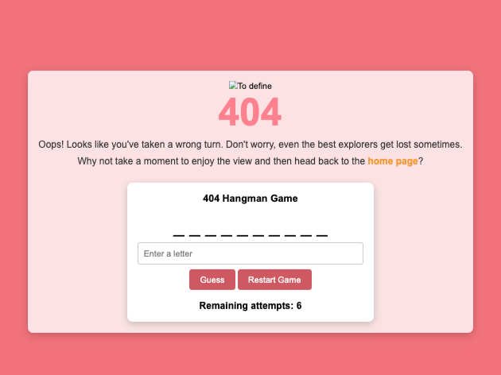
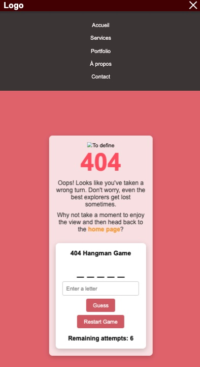

# Page 404 🚧

This project is a custom 404 error page that provides a visually appealing and interactive experience for users who encounter a page not found error.

## 📖 Table of Contents

- [Description](#description)
- [Features](#features)
- [Technologies](#technologies)
- [Setup](#setup)
- [Usage](#usage)
- [Contributing](#contributing)
- [License](#license)

## ✨ Description

The custom 404 error page is designed to replace the default browser error page with a more engaging and user-friendly version. It includes an animated image, a creative error message, and a mini Hangman game for users to play while they navigate back to the home page.

## ⚙️ Features

- 🌟 Visually appealing animated image.
- 📝 Informative error message.
- 🎮 Interactive Hangman game.
- 🔗 Navigation links to the home page.
- 📱 Responsive design for mobile and desktop screens.

## 🛠️ Technologies

- HTML5
- CSS3 (with animations)
- JavaScript (for Hangman game functionality)

## 🚀📝 Instructions

1. Open the `index.html` file in a web browser to view the custom 404 page.

## 🕹️ Usage

1. When a user encounters a 404 error on the website, they will be redirected to this custom error page.
2. The animated image and error message will provide a friendly and engaging experience.
3. Users can interact with the Hangman game to pass the time while navigating back to the home page.

## 👤 Author

Steeve Zych

---

*This project was created as part of the learning process at [BeCode](https://becode.org/).*

## Démo du Projet

Check out the live demo of the page 404 [here.](https://64db6d095df0105ab660f574--fantastic-semolina-6acb0c.netlify.app/)

