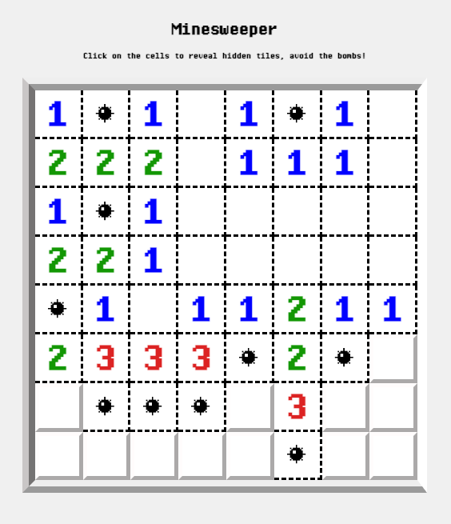

# Minesweeper Game

Welcome to the Minesweeper game! This classic game involves revealing all cells on the board without triggering hidden bombs. Have fun solving the puzzles and avoiding the bombs!

## 📖 Table of Contents

- [Introduction](#introduction)
- [How to Play](#how-to-play)
- [Instructions](#instructions)
- [Technologies Used](#technologies-used)
- [Author](#author)

## 🎮 Introduction

The Minesweeper game is a digital version of the classic board game where players reveal cells on a grid to avoid hidden bombs.

### Features

- Display an 8x8 grid representing the game field.
- Utilize Flexbox for layout design.
- Hidden cells reveal bombs or numbers on mouse hover.
- "Game Over" message displays upon discovering a bomb.
- Restart the game functionality.

## 🕹️ How to Play

1. Click on a cell to reveal its content.
2. If the cell reveals a bomb, the game displays "GAME OVER" and prompts you to restart.
3. If the cell reveals a number, it indicates the number of adjacent bombs.
4. Use the revealed numbers to deduce the locations of the bombs.
5. Reveal all bomb-free cells to win!

## 📝 Instructions

1. Open the `index.html` file in a web browser.
2. Click on cells to reveal them.
3. If you reveal a bomb, the game displays "GAME OVER" and a button to restart.

## 🛠️ Technologies Used

- HTML
- CSS
- JavaScript

## 👤 Author

Steeve Zych

---

*This project was created as part of the learning process at [BeCode](https://becode.org/).*

## Démo du Projet

Check out the live demo of the Minesweeper game [here.](https://64d8d636763dcc14d0250cd0--admirable-clafoutis-ecbd45.netlify.app/)
