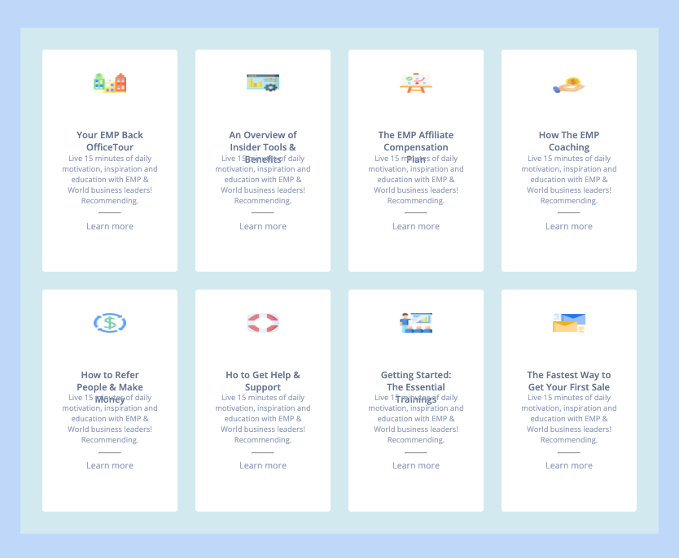

<h1 align="center">CSS Grid Project</h1>

  

This project is a demonstration of using CSS Grid to create a responsive card layout with information about a service.

## 🚀 Features

- Responsive layout using CSS Grid to adapt to different screen sizes.
- Use of Google Fonts "Open Sans" for legible and elegant text.
- Utilization of FontAwesome for button icons.
- Hover effects for buttons and cards to enhance interactivity.
- Cards showcasing information on different aspects of a service.

## 🛠️ Technologies Used

- HTML
- CSS

👤 Author
Steeve Zych

*This project was created as part of the learning process at [BeCode](https://becode.org/).*

## Démo du Projet

Check out the live demo of the Minesweeper game [here.](https://64d8e407faf3191eee5eecc7--frabjous-otter-f1513d.netlify.app/)